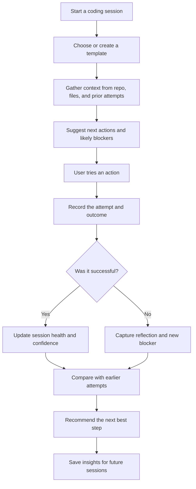

# Coding Features Brainstorm for Replica

## Core direction
Replica already has a strong reflection loop for coding sessions. The next wave of features should make that loop faster, smarter, and easier to reuse across sessions.

## Recently completed
- Prevent duplicate coding sessions caused by rapid repeated form submission.
- Delete a coding session from its list card with a destructive confirmation modal.
- Regenerate a better next prompt from an attempt that already has a completed reflection.
- Copy an attempt's original prompt directly from attempt history with an accessible icon button.
- Distinguish first prompt generation from later regeneration in the button state and label.

These changes shorten the retry cycle while preserving attempts, outcomes, session context, and the existing reflection workflow.

## Feature ideas

### 1. Session templates
- Create reusable templates for common coding tasks such as bug fixes, refactors, feature implementation, and test writing.
- Each template can prefill context fields, goals, constraints, and recommended modes.
- Benefit: reduces setup time for repeat work.

### 2. Prompt improvement history
- Track how each prompt evolved over time and show which changes led to better outcomes.
- Highlight patterns like “more context” vs “shorter prompt” vs “clearer outcome goal”.
- Benefit: helps users learn what works for their workflow.

### 3. Auto-summarized attempt outcomes
- Automatically detect whether an attempt was helpful, partially helpful, fixed the issue, or made things worse.
- Suggest a one-line outcome summary based on the logged notes and result summary.
- Benefit: reduces manual logging and improves insight quality.

### 4. Smart context suggestions
- Suggest relevant files, constraints, and assumptions from prior attempts in the same session.
- Surface likely missing context before generating the next prompt.
- Benefit: improves prompt quality without requiring manual copy-paste.

### 5. Reflection-driven next action recommendations
- Go beyond a recommended mode and suggest concrete next steps such as:
  - add missing test coverage
  - inspect a particular file
  - run a specific command
  - change the prompt structure
- Benefit: turns reflection into actionable follow-up work.

### 6. Attempt comparison view
- Compare multiple attempts side by side to see which prompt structure worked best.
- Show status, outcome, outcome notes, and reflection quality for each attempt.
- Benefit: makes it easier to learn from past failures.

### 7. Session health score
- Score each coding session based on reflection quality, adherence to recommendations, and outcome improvement over time.
- Show trends such as “improving”, “stalled”, or “needs more context”.
- Benefit: gives a simple signal for where debugging effort is paying off.

### 8. Import from external tools
- Import coding logs from tools like Claude, Cursor, GitHub Copilot Chat, or terminal transcripts.
- Normalize them into attempts and reflections inside Replica.
- Benefit: expands the app beyond manual logging.

### 9. AI-assisted session summaries
- Generate a compact session summary after a few attempts:
  - current problem
  - likely root cause
  - best prompt pattern
  - recommended next step
- Benefit: creates a strong handoff between sessions.

### 10. Tagging and categorization
- Add tags such as bug, feature, refactor, performance, test, integration, and infra.
- Allow filtering by tag and outcome.
- Benefit: improves organization for larger personal coding histories.

### 11. Shared prompt snippets library
- Save effective prompt structures and reuse them across sessions.
- Include “why this prompt works” notes for each snippet.
- Benefit: makes best practices portable.

### 12. Retry planner
- After a failed attempt, offer a structured retry plan with options such as:
  - add more context
  - narrow the scope
  - ask for debugging steps
  - change the tool or model
- Benefit: turns failure into a guided retry workflow.

## UX ideas
- Add a “suggested next prompt” panel that appears after each reflection.
- Make the session view more compact with collapsible sections.
- Add keyboard shortcuts for logging attempts and saving reflections.
- Support drag-and-drop ordering for attempts and context notes.

## Data and insights ideas
- Show weekly trends in prompt quality and outcomes.
- Highlight repeated failure patterns across sessions.
- Surface the most common missing context types.
- Build a “learning dashboard” for the user’s coding habits.

## How it works

## Best first opportunities
If the goal is to ship quickly, the highest-value features are:
1. Session templates
2. Smart context suggestions
3. Reflection-driven next action recommendations
4. Attempt comparison view
5. AI-assisted session summaries
